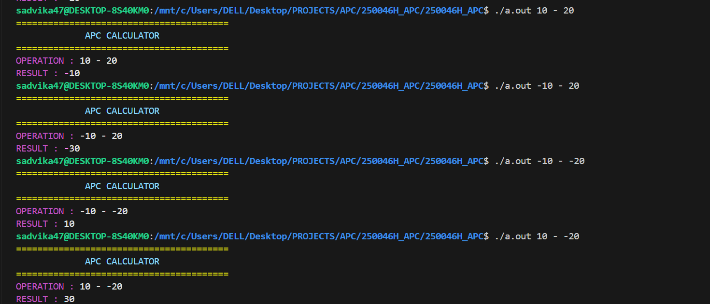
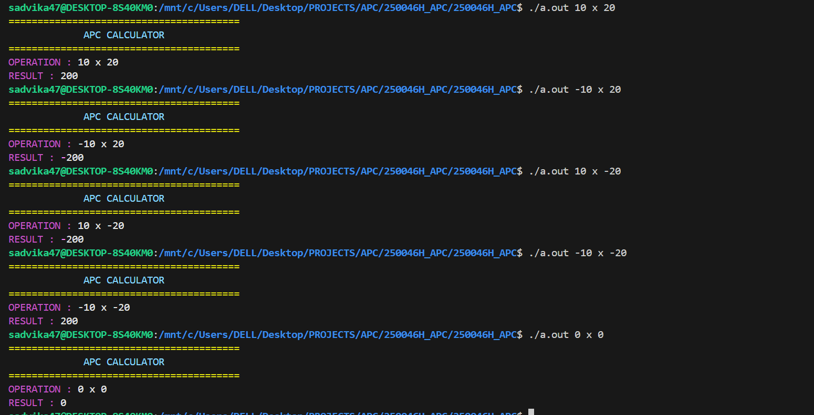
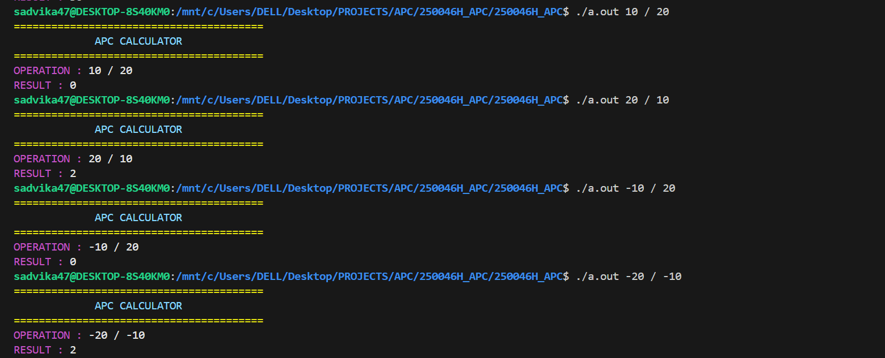
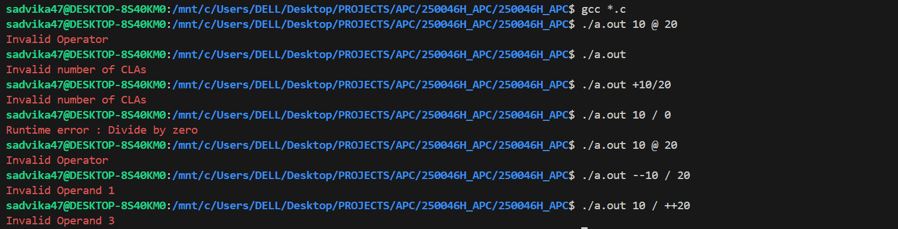

## apc-in-c
##Overview

- APC (Arbitrary Precision Calculator) is a console-based C program that performs arithmetic operations on very large integers that exceed the limits of standard C data types.
- This project uses linked lists to represent numbers digit-by-digit, enabling high-precision calculations. It demonstrates data structures, pointers, dynamic memory allocation, and file modularization in C, while building a real-world calculator engine.

## Features

### Perform arithmetic on arbitrarily large integers
- Supports core operations:
➕ Addition
➖ Subtraction
✖ Multiplication
➗ Division

- Linked list based number representation
- Efficient carry and borrow handling
- Modular and structured C implementation
- Lightweight and implemented entirely in C

## How to Run
### Clone the repository
git clone https://github.com/sadvika-ch/apc-in-c.git
cd apc-in-c

### Compile the program
gcc *.c -o apc

### Run the program
./apc

## Usage
### Addition example
./apc 123456789123456789 + 987654321987654321

### Subtraction example
./apc 987654321987654321 - 123456789123456789

### Multiplication example
./apc 123456789 * 987654321

### Division example
./apc 987654321987654321 / 123456789

## Notes
- Numbers are internally stored using linked lists, one digit per node.
- This allows handling numbers of unlimited length (memory dependent).
- The program avoids built-in data types like int, long, long long for calculations.
- Designed as a learning-oriented system-level project for understanding:
    - memory management
    - pointer manipulation
    - algorithm design
    - modular programming in C

## Skills Learned
- C programming
- Linked list implementation
- Dynamic memory allocation (malloc, free)
- Pointer manipulation
- Algorithmic logic for arithmetic operations
- Modular project structuring
- Debugging large-scale C programs

## Screenshots
### Addition

### Subtraction

### Multiplication

### Division

### Errors

### To Exit
